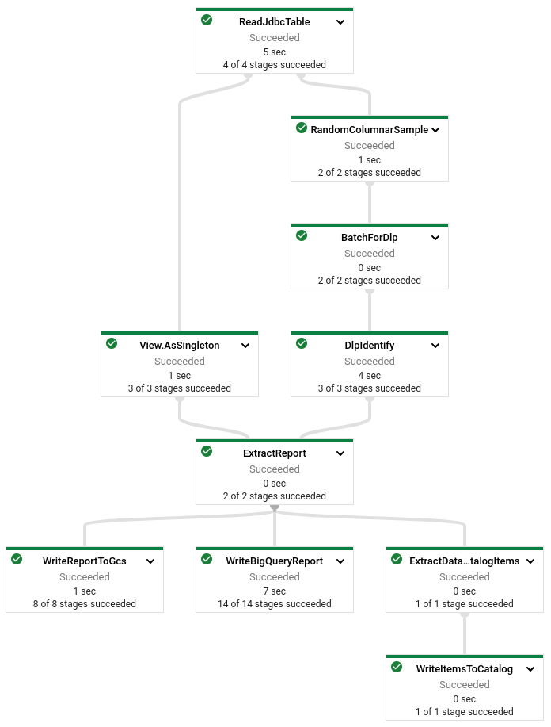

Anant Damle | Solutions Architect | Google

<i>Contributed by Google employees.</i>

This tutorial demonstrates how to identify and apply data sensitivity tags for your data in Cloud Storage files, relational databases (like MySQL, PostgreSQL, etc.) and BigQuery using [Data Catalog](https://cloud.google.com/data-catalog) with an automated Dataflow pipeline.

This pipeline uses [Cloud Data Loss Prevention (Cloud DLP)](https://cloud.google.com/dlp) to detect sensitive data like personally identifiable information
(PII), followed by tagging the findings in Data Catalog.

The solution described in this document builds on the architecture of the file-based tokenizing solution described in
the [companion document](https://cloud.google.com/community/tutorials/auto-data-tokenize). The primary difference is that the current document describes a
solution that additionally creates Data Catalog entry and tags for DLP findings, and adds the capability to inspect relational databases using JDBC connections.

This document is intended for a technical audience whose responsibilities include data security, data governancve, data processing, or data analytics. This document assumes that you're familiar with data processing and data privacy, without the need to be an expert. This document assumes some familiarity with shell scripts and basic knowledge of Google Cloud.

## Costs

This tutorial uses billable components of Google Cloud, including the following:

* [Dataflow](https://cloud.google.com/dataflow/pricing)
* [Cloud Storage](https://cloud.google.com/storage/pricing)
* [Data Catalog](https://cloud.google.com/data-catalog/pricing)
* [Cloud SQL](https://cloud.google.com/sql/pricing)
* [Cloud Data Loss Prevention](https://cloud.google.com/dlp/pricing)

Use the [pricing calculator](https://cloud.google.com/products/calculator) to generate a cost estimate based on your
projected usage.

## Architecture

The solution described in this tutorial comprises a pipeline that extracts the data from any one of the sources, samples the records and processes them through Cloud Data Loss Prevention (DLP) API to identify sensitivity categories.

The solution uses JDBC connection to access relational databases, when using BigQuery tables as a data source, the solution uses the [BigQuery Storage API](https://cloud.google.com/bigquery/docs/reference/storage) to improve
load times.

The *sample-and-identify* pipeline outputs the following files to Cloud Storage:

  * Avro schema (equivalent) of the source's schema
  * Detected [InfoTypes](https://cloud.google.com/dlp/docs/infotypes-reference) for each of the input columns

This solution uses [record flattening](https://cloud.google.com/community/tutorials/auto-data-tokenize#concepts) to handle nested and repeated fields in records.

## Before you begin

For this tutorial, you need a Google Cloud [project](https://cloud.google.com/resource-manager/docs/cloud-platform-resource-hierarchy#projects). To make
cleanup easiest at the end of the tutorial, we recommend that you create a new project for this tutorial.

1.  [Create a Google Cloud project](https://console.cloud.google.com/projectselector2/home/dashboard).
1.  Make sure that [billing is enabled](https://support.google.com/cloud/answer/6293499#enable-billing) for your Google
    Cloud project.
1.  [Open Cloud Shell](https://console.cloud.google.com/?cloudshell=true).

    At the bottom of the Cloud Console, a [Cloud Shell](https://cloud.google.com/shell/docs/features) session opens and
    displays a command-line prompt. Cloud Shell is a shell environment with the Cloud SDK already installed, including
    the [gcloud](https://cloud.google.com/sdk/gcloud/) command-line tool, and with values already set for your current
    project. It can take a few seconds for the session to initialize.

1.  Enable APIs for Cloud DLP, Compute Engine, Cloud Storage, Dataflow, and Cloud SQL:

        gcloud services enable \
        dlp.googleapis.com \
        compute.googleapis.com \
        storage.googleapis.com \
        dataflow.googleapis.com \
        sql-component.googleapis.com \
        sqladmin.googleapis.com

## Setting up your environment

1.  In Cloud Shell, clone the source repository and go to the directory for this tutorial:

        git clone https://github.com/GoogleCloudPlatform/auto-data-tokenize.git
        cd auto-data-tokenize/

1.  Use a text editor to modify the `set_variables.sh` file to set the required environment variables:

        # The Google Cloud project to use for this tutorial
        export PROJECT_ID="[YOUR_PROJECT_ID]"

        # The Compute Engine region to use for running Dataflow jobs and create a
        # temporary storage bucket
        export REGION_ID="[YOUR_COMPUTE_ENGINE_REGION]"

        # The Cloud Storage bucket to use as a temporary bucket for Dataflow
        export TEMP_GCS_BUCKET="[CLOUD_STORAGE_BUCKET_NAME]"

        # Name of the service account to use (not the email address)
        export DLP_RUNNER_SERVICE_ACCOUNT_NAME="[SERVICE_ACCOUNT_NAME_FOR_RUNNER]"

        # Fully Qualified Entry Group Id to use for creating/searching for Entries
        # in Data Catalog for non-BigQuery entries.
        export DATA_CATALOG_ENTRY_GROUP_ID="[NON_BIGQUERY_DATA_CATALOG_ENTRY_GROUP]"

        # The fully qualified Data Catalog Tag Template Id to use
        # for creating sensitivity tags in Data Catalog.
        export INSPECTION_TAG_TEMPLATE_ID="[DATA_CATALOG_TAG_TEMPLATE_NAME]"

1.  Run the script to set the environment variables:

        source set_variables.sh

## Creating resources

The tutorial uses following resources:

 * A service account to run Dataflow pipelines, enabling fine-grained access control
 * A Cloud Storage bucket for temporary data storage and test data
 * A Data Catalog Tag Template to attach sensitivity tags to entries
 * A MySQL on Cloud SQL instance as JDBC source

### Create service accounts

We recommend that you run pipelines with fine-grained access control to improve access partitioning. If your project doesn't have a user-created service account,
create one using following instructions.

You can use your browser by going to [**Service accounts**](https://console.cloud.google.com/projectselector/iam-admin/serviceaccounts?supportedpurview=project)
page in the Cloud Console.

1.  Create a service account to use as the user-managed controller service account for Dataflow:

        gcloud iam service-accounts create ${DLP_RUNNER_SERVICE_ACCOUNT_NAME} \
        --project="${PROJECT_ID}" \
        --description="Service Account for Sampling and Cataloging pipelines." \
        --display-name="Sampling and Cataloging pipelines"

1.  Create a custom role with required permissions for accessing Cloud DLP, Dataflow, Cloud SQL, and Data Catalog:

        export SAMPLING_CATALOGING_ROLE_NAME="sampling_cataloging_runner"

        gcloud iam roles create ${SAMPLING_CATALOGING_ROLE_NAME} \
        --project=${PROJECT_ID} \
        --file=sampling_and_cataloging_runner_permissions.yaml

1.  Apply the custom role to the service account:

        gcloud projects add-iam-policy-binding ${PROJECT_ID} \
        --member="serviceAccount:${DLP_RUNNER_SERVICE_ACCOUNT_EMAIL}" \
        --role=projects/${PROJECT_ID}/roles/${SAMPLING_CATALOGING_ROLE_NAME}

1.  Assign the `dataflow.worker` role to allow the service account to allow it to run as a Dataflow worker:

        gcloud projects add-iam-policy-binding ${PROJECT_ID} \
        --member="serviceAccount:${DLP_RUNNER_SERVICE_ACCOUNT_EMAIL}" \
        --role=roles/dataflow.worker

### Create the Cloud Storage bucket

Create a Cloud Storage bucket for storing test data and Dataflow staging location:

    gsutil mb -p ${PROJECT_ID} -l ${REGION_ID} "gs://${TEMP_GCS_BUCKET}"

### Create Inspection Tag tempalte

Create a Data Catalog tag template to allow tagging entries with sensitvity information extracted using Cloud DLP.

    gcloud data-catalog tag-templates create ${INSPECTION_TAG_TEMPLATE_ID} \
    --project="${PROJECT_ID}" \
    --location="${REGION_ID}" \
    --display-name="Auto DLP sensitive categories" \
    --field=id=infoTypes,type=string,display-name="DLP InfoTypes",required=TRUE \
    --field=id=inspectTimestamp,type=timestamp,display-name="Inspection run timestamp",required=TRUE

### Crete MySQL on Cloud SQL instance

You will use a Cloud SQL instance as a source of your data. Instanciate a MySQL on Cloud SQL and load with sample data.

    export SQL_INSTANCE="mysql-autodlp-instance"

    gcloud sql instances create "${SQL_INSTANCE}" \
    --project="${PROJECT_ID}" \
    --region="${REGION_ID}" \
    --database-version=MYSQL_5_7 \
    --root-password=root1234

**Note:** Please be patient as it may take a some time to spin-up a new instance.

#### Copy test data to Cloud SQL instance

You can use your own file datasets or copy the included demonstration dataset (`contacts5k.sql.gz`).

1.  Copy the sample dataset to Cloud Storage for staging into Cloud SQL:

        gsutil cp contacts5k.sql.gz gs://${TEMP_GCS_BUCKET}

1.  Create a new Database in the Cloud SQL instance:

        export DATABASE_ID="auto_dlp_test"

        gcloud sql databases create "${DATABASE_ID}" \
        --project="${PROJECT_ID}" \
        --instance="${SQL_INSTANCE}"
1.  Provide Cloud Storage access to Cloud SQL Service account to enable importing data:

        export SQL_SERVICE_ACCOUNT=$(gcloud sql instances describe "${SQL_INSTANCE}" --project="${PROJECT_ID}" | grep serviceAccountEmailAddress: | sed "s/serviceAccountEmailAddress: //g")

        gsutil iam ch "serviceAccount:${SQL_SERVICE_ACCOUNT}:objectAdmin" gs://${TEMP_GCS_BUCKET}

    Learn more about [Importing data into Cloud SQL](https://cloud.google.com/sql/docs/mysql/import-export/importing#mysqldump).

1.  Load the data in a new table:

        gcloud sql import sql "${SQL_INSTANCE}" \
        "gs://${TEMP_GCS_BUCKET}/contacts5k.sql.gz" \
        --project="${PROJECT_ID}" \
        --database="${DATABASE_ID}"

## Compile modules

Build the executables for deploying the sample-and-identify and tokenize pipelines.

     ./gradlew clean buildNeeded shadowJar

**Tip**: To skip running the tests, you can add the `-x test` flag.

## Using the sample-and-identify pipeline

Run the sample-and-identify pipeline to identify sensitive columns in the data that you need to tokenize.

The pipeline extracts `sampleSize` number of records, flattens the record and identifies sensitive columns
using [Cloud DLP](https://cloud.google.com/dlp). Cloud DLP provides functionality
to [identify](https://cloud.google.com/dlp/docs/inspecting-text) sensitive information types. The Cloud DLP identify method
supports only flat tables, so the pipeline flattens the Avro, Parquet or BigQuery records, since they can contain nested and repeated fields.

### Create Data Catalog Entry Group

The Data Catalog maintains a list of Entries that represent Google Cloud or other resources. The Entries are kept under Entry Groups. There exist an implicit Entry Group for BigQuery, for other types of resources, you need to create Entry Groups. Learn how about [Data Catalog entries](https://cloud.google.com/data-catalog/docs/how-to/filesets).

Create a new Entry Group to create entry for your MySQL Database.

    export DATA_CATALOG_ENTRY_GROUP_ID="sql_databases"

    gcloud data-catalog entry-groups create \
    "${DATA_CATALOG_ENTRY_GROUP_ID}" \
    --project="${PROJECT_ID}" \
    --location="${REGION_ID}"

**Note:** Ensure that location is one of the [Data Catalog regions](https://cloud.google.com/data-catalog/docs/concepts/regions).

### Create Dataflow Flex template

[Dataflow templates](https://cloud.google.com/dataflow/docs/concepts/dataflow-templates) allow you to use the Cloud Console, the `gcloud` command-line tool, or
REST API calls to set up your pipelines on Google Cloud and run them. Classic templates are staged as execution graphs on Cloud Storage; Flex Templates bundle
the pipeline as a container image in your project’s registry in Container Registry. This allows you to decouple building and running pipelines, as well as
integrate with orchestration systems for daily execution. For more information, see
[Evaluating which template type to use](https://cloud.google.com/dataflow/docs/concepts/dataflow-templates#comparing-templated-jobs) in the Dataflow 
documentation.

[Dataflow Flex templates](https://cloud.google.com/dataflow/docs/concepts/dataflow-templates#templated-dataflow-jobs) 
make it possible to launch a Dataflow pipeline without having to compile code or access to development environment.
Dataflow pipelines based on Flex templates can be started from Cloud Composer using [DataflowStartFlexTemplateOperator](https://airflow.apache.org/docs/apache-airflow-providers-google/stable/_api/airflow/providers/google/cloud/operators/dataflow/index.html#airflow.providers.google.cloud.operators.dataflow.DataflowStartFlexTemplateOperator).

1.  Define the location to store the template spec file containing all of the necessary information to run the job:

        export FLEX_TEMPLATE_PATH="gs://${TEMP_GCS_BUCKET}/dataflow/templates/sample-inspect-tag-pipeline.json"
        export FLEX_TEMPLATE_IMAGE="us.gcr.io/${PROJECT_ID}/dataflow/sample-inspect-tag-pipeline:latest"

1.  Build the Dataflow Flex template:

        gcloud dataflow flex-template build "${FLEX_TEMPLATE_PATH}" \
        --image-gcr-path="${FLEX_TEMPLATE_IMAGE}" \
        --service-account-email="${DLP_RUNNER_SERVICE_ACCOUNT_EMAIL}" \
        --sdk-language="JAVA" \
        --flex-template-base-image=JAVA11 \
        --metadata-file="sample_identify_tag_pipeline_metadata.json" \
        --jar="build/libs/autotokenize-all.jar" \
        --env="FLEX_TEMPLATE_JAVA_MAIN_CLASS=\"com.google.cloud.solutions.autotokenize.pipeline.DlpSamplerIdentifyPipeline\""

### Run the sample-and-identify pipeline

The sampling and DLP identification pipeline will:

  1.  **Extract** records from the provided source
      *  _Optionally_ the records are flattened if nesting/repeated structures are identified.
  1.  **Sample** the individual columns for required samples, excluding `null` or empty values
  1.  **Identify** sensitive InfoTypes using DLP, by batching the samples into DLP acceptabe batch-sizes
  1.  **Findings Report** is then written to Cloud Storage for future reference.
  1.  **Data Catalog Export** When Tag Template and Entry Group information is provided, the pipeline will also create sensitivity tags for entries in Data Catalog against appropriate columns.

Launch the sampling and DLP identification pipeline:

    export CLOUD_SQL_JDBC_CONNECTION_URL="jdbc:mysql:///${DATABASE_ID}?cloudSqlInstance=${PROJECT_ID}%3A${REGION_ID}%3A${SQL_INSTANCE}&socketFactory=com.google.cloud.sql.mysql.SocketFactory&user=root&password=root1234"

    gcloud dataflow flex-template run "sample-inspect-tag-`date +%Y%m%d-%H%M%S`" \
    --template-file-gcs-location "${FLEX_TEMPLATE_PATH}" \
    --region "${REGION_ID}" \
    --service-account-email "${DLP_RUNNER_SERVICE_ACCOUNT_EMAIL}" \
    --staging-location "gs://${TEMP_GCS_BUCKET}/staging" \
    --worker-machine-type "n1-standard-1" \
    --parameters sampleSize=1000 \
    --parameters sourceType="JDBC_TABLE" \
    --parameters inputPattern="Contacts" \
    --parameters reportLocation="gs://${TEMP_GCS_BUCKET}/auto_dlp_report/" \
    --parameters jdbcConnectionUrl="${CLOUD_SQL_JDBC_CONNECTION_URL}" \
    --parameters jdbcDriverClass="com.mysql.cj.jdbc.Driver" \
    --parameters dataCatalogEntryGroupId="projects/${PROJECT_ID}/locations/${REGION_ID}/entryGroups/${DATA_CATALOG_ENTRY_GROUP_ID}" \
    --parameters dataCatalogInspectionTagTemplateId="projects/${PROJECT_ID}/locations/${REGION_ID}/tagTemplates/${INSPECTION_TAG_TEMPLATE_ID}"

The `jdbcConnectionUrl` specifies a JDBC database connection url with user and password details. The details of building the exact connection url would depend on your database vendor and hosting partner.
Learn more about [connecting using Cloud SQL connectors](https://cloud.google.com/sql/docs/mysql/connect-connectors) to understand details for connecting to Cloud SQL based relational databases.

The pipeline supports multiple source types. Use the following table to determine the right combination of `sourceType` and `inputPattern` arguments.

| Data source                       | sourceType       | inputPattern                                    |
| --------------------------------- | ---------------- | ----------------------------------------------- |
| Relational Databases (using JDBC) | `JDBC_TABLE`     | `[TABLE_NAME]`                                  |
| Avro file in Cloud Storage        | `AVRO`           | `gs://[LOCATION_OF_FILES]`                      |
| Parquet file in Cloud Storage     | `PARQUET`        | `gs://[LOCATION_OF_FILES]`                      |
| BigQuery table                    | `BIGQUERY_TABLE` | `[PROJECT_ID]:[DATASET].[TABLE]`                |

The pipeline detects all of the [standard infoTypes](https://cloud.google.com/dlp/docs/infotypes-reference) supported by Cloud DLP.
You can provide additional custom infoTypes that you need by using the `--observableInfoTypes` parameter.

### Sample-and-identify pipeline DAG

The Dataflow execution DAG (directed acyclic graph) looks like the following:

### Retrieve the report

The sample-and-identify pipeline outputs the Avro schema (or converted for Parquet) of the files and one file for each of the columns determined to contain
sensitive information.

1.  Retrieve the report to your local machine:

        mkdir -p auto_dlp_report/ && rm auto_dlp_report/*.json
        gsutil -m cp "gs://${TEMP_GCS_BUCKET}/auto_dlp_report/*.json" auto_dlp_report/

1.  List all the column names that have been identified:

        cat auto_dlp_report/col-*.json | jq .columnName

    The output matches the following list:

        "$.topLevelRecord.contact_number"
        "$.topLevelRecord.person_name"

1.  View the details of an identified column with the `cat` command for the file:

        cat auto_dlp_report/col-topLevelRecord-contact_number-00000-of-00001.json

    The following is a snippet of the `cc` column:

        {
         "columnName": "$.topLevelRecord.contact_number",
         "infoTypes": [{
           "infoType": "PHONE_NUMBER",
           "count": "990"
         }]
       }

    * Don't be alarmed by the unusual `columnName` value. That's due to implict conversion of a database row to an Avro record.
    * The `"count"` value varies based on the randomly selected samples during execution.

### Verify tags in Data Catalog

The sampling pipeline would have created a new entry and applied the sensitivity tags to appropriate columns.

Retrieve the created Entry for the **Contacts** table :

    gcloud data-catalog entries describe Contacts \
    --entry-group=${DATA_CATALOG_ENTRY_GROUP_ID} \
    --project="${PROJECT_ID}" \
    --location="${REGION_ID}"

This would show the details of the table, including its schema.

Show all the tags attached to this Entry:

    gcloud data-catalog tags list --entry=Contacts --entry-group=${DATA_CATALOG_ENTRY_GROUP_ID} \
    --project="${PROJECT_ID}" \
    --location="${REGION_ID}"

Verify that sensitivity tags are present on following columns:
  * contact_number
  * person_name

The tag details look as below:

    ---
    column: contact_number
    fields:
      infoTypes:
        displayName: DLP InfoTypes
        stringValue: '[PHONE_NUMBER]'
      inspectTimestamp:
        displayName: Inspection run timestamp
        timestampValue: '2021-05-20T16:34:29.596Z'
    name: projects/auto-dlp/locations/asia-southeast1/entryGroups/sql_databases/entries/Contacts/tags/CbS0CtGSpZyJ
    template: projects/auto-dlp/locations/asia-southeast1/tagTemplates/auto_dlp_inspection
    templateDisplayName: Auto DLP sensitive categories
    ---
    column: person_name
    fields:
      infoTypes:
        displayName: DLP InfoTypes
        stringValue: '[DATE]'
      inspectTimestamp:
        displayName: Inspection run timestamp
        timestampValue: '2021-05-20T16:34:29.594Z'
    name: projects/auto-dlp/locations/asia-southeast1/entryGroups/sql_databases/entries/Contacts/tags/Cds1aiO8R0pT
    template: projects/auto-dlp/locations/asia-southeast1/tagTemplates/auto_dlp_inspection
    templateDisplayName: Auto DLP sensitive categories

## Cleaning up

To avoid incurring charges to your Google Cloud account for the resources used in this tutorial, you can delete the project:

1.  In the Cloud Console, go to the [**Manage resources** page](https://console.cloud.google.com/iam-admin/projects).
1.  In the project list, select the project that you want to delete and then click **Delete**.
1.  In the dialog, type the project ID and then click **Shut down** to delete the project.

## What's next

* Read the companion document about a similar solution that uses files as input:
[Automatically tokenize sensitive file-based data with Cloud Data Loss Prevention, Cloud Key Management Service, and Dataflow](https://cloud.google.com/community/tutorials/auto-data-tokenize).
* Learn about [inspecting storage and databases for sensitive data](https://cloud.google.com/dlp/docs/inspecting-storage).
* Learn about handling
  [de-identification and re-identification of PII in large-scale datasets using Cloud DLP](https://cloud.google.com/solutions/de-identification-re-identification-pii-using-cloud-dlp).
* Learn more about [Cloud DLP](https://cloud.google.com/dlp).
* Learn more about [BigQuery](https://cloud.google.com/bigquery).
